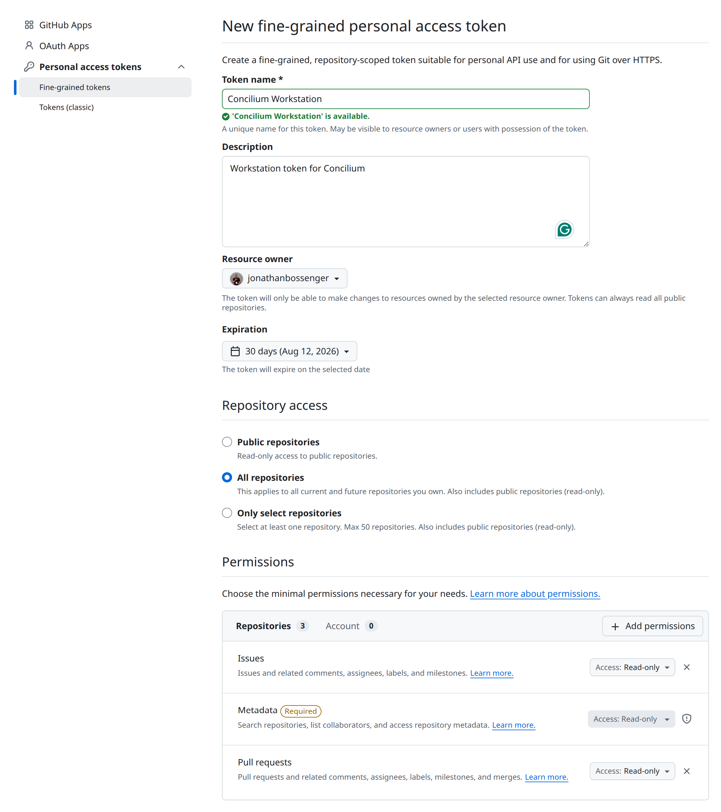

# Creating and storing your GitHub token

Concilium can make authenticated GitHub API calls if you provide a personal
access token.

A token is **required for the New Project flow** (⧉ in the header) because
repository creation uses authenticated `POST /user/repos`. For read-only
features (for example the active-agent indicator on PR rows), a token is
optional, but unauthenticated requests are rate-limited more aggressively.

## Token type

Use a **fine-grained** personal access token. Fine-grained tokens let you grant
Concilium exactly the access it needs — read/write on Issues and Pull requests —
and nothing else, rather than the broad `repo` scope a classic token requires.

A fine-grained token can also read **any public repository** and act on private
repositories you have access to but do not own (for example an organization's
repos or a repo you collaborate on), as long as the token's **resource owner**
grants that access. This covers Concilium's cross-repository browsing.

Classic tokens still work if you already have one, but fine-grained is
preferred.

## Create a token

Create a fine-grained token at
<https://github.com/settings/personal-access-tokens/new>.

1. **Token name** — any memorable name (for example `Concilium Workstation`).
2. **Description** — optional.
3. **Resource owner** — your own account for personal repos. To reach an
   organization's repositories, pick that organization as the resource owner
   (org approval may be required).
4. **Expiration** — set an expiry date.
5. **Repository access** — choose **All repositories** so the token covers every
   repo you own now or later. (Pick **Only select repositories** to limit it to a
   specific set.)
6. **Permissions → Repository permissions** — grant:
   - **Issues** — *Read and write* (read to browse issues; write to assign
     issues to Copilot).
   - **Pull requests** — *Read and write* (read to browse PRs and show the
     active-agent indicator; write for PR operations).
   - **Metadata** — *Read-only*. GitHub selects this automatically and marks it
     **Required** once you pick any other repository permission.

   If you only ever browse (never assign issues or create repos), *Read-only* on
   Issues and Pull requests is enough.
7. To also use the **New Project flow** (repository creation), add
   **Administration** — *Read and write*, which `POST /user/repos` requires.
   Optionally this also lets Concilium delete an orphaned repo when a post-create
   `git clone` fails (rare — usually only flaky networks); without it, the
   orphaned repo stays on GitHub and the UI shows its URL so you can delete it
   manually.
8. Click **Generate token**, copy it, then paste it into **Settings (⚙) → GitHub
   token**. Submit an empty value to clear it.

## Storage

Concilium stores the token as `githubToken` in:

`~/.concilium/config.yaml`

Keep `~/.concilium/` readable only by your user account.
